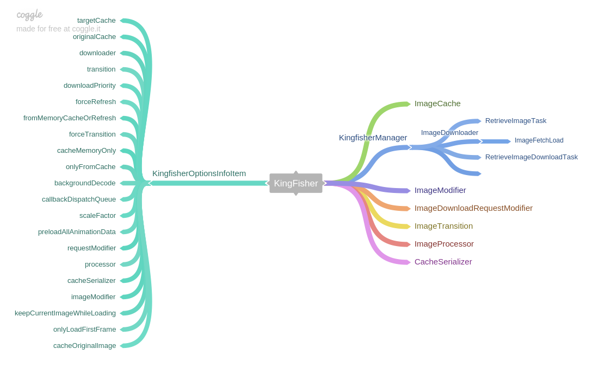

<!-- <link rel="stylesheet" href="http://yandex.st/highlightjs/8.0/styles/solarized_dark.min.css">
<script src="http://cdn.bootcss.com/highlight.js/8.0/highlight.min.js"></script>
<script>hljs.initHighlightingOnLoad();</script> -->

> Kingfisher is a lightweight, pure-Swift library for downloading and caching
> images from the web. This project is heavily inspired by the popular
> SDWebImage. It provides you a chance to use a pure-Swift alternative in your
> next app.

Kingfisher 是一个轻量级的，纯 swift 语言的网络图片下载和缓存库。这个项目受到流行
的 SDWebImage 的极大启发。

## 结构：



## protocol:

* KingfisherCompatible

UIImage,UIImageView,UIButton 的扩展`KingfisherCompatible`提供了链式访问`.kf`的扩
展 , 方便访问`Kingfisher`实例。

## Kingfisher

Kingfisher 库的访问类，final 不可继承。

Kingfisher 持有属性`base`，是 UIImage,UIImageView 或者 UIButton 的实例。

## ImageView 扩展

提供了两个扩展方法：

```swift
// 设置网络图片
public func setImage(with resource: Resource?,
                     placeholder: Placeholder? = nil,
                     options: KingfisherOptionsInfo? = nil,
                     progressBlock: DownloadProgressBlock? = nil,
                     completionHandler: CompletionHandler? = nil) -> RetrieveImageTask
// 取消下载任务
public func cancelDownloadTask()
```

参数：

* `Resource`: 图片资源协议，包括图片的`cacheKey`以及`downloadURL`, 提供
  了`ImageResource`结构体实现此协议。

* `Placeholder`：图片占位符协议，提供了向 `UIImageView` 添加和删除占位符的接口
  ，`UIImage` 默认实现此协议，经自身设置给 UIImageView

* `KingfisherOptionsInfo`:

* `DownloadProgressBlock`：下载进程回调 block 闭包

```swift
((_ receivedSize: Int64, _ totalSize: Int64) -> ())
```

回调包含参数`receivedSize`和`totalSize`

* `completionHandler`：下载完成回调 block 闭包，

```swift
((_ image: Image?, _ error: NSError?, _ cacheType: CacheType, _ imageURL: URL?) -> ())
```

<!-- 回调中包含 -->

## KingfisherManager

下载与缓存的管理类，提供单例`shared`, 包含 `ImageCache`和`ImageDownloader`实例。

下载方法：

* 根据缓存策略调用下载或尝试从缓存获取图片数据

```swift
public func retrieveImage(with resource: Resource,
      	                  options: KingfisherOptionsInfo?,
      	                  progressBlock: DownloadProgressBlock?,
      	                  completionHandler: CompletionHandler?) -> RetrieveImageTask
```

* 下载并缓存图片数据

```swift
func downloadAndCacheImage(with url: URL,
                          forKey key: String,
                  retrieveImageTask: RetrieveImageTask,
                      progressBlock: DownloadProgressBlock?,
                  completionHandler: CompletionHandler?,
                            options: KingfisherOptionsInfo) -> RetrieveImageDownloadTask?
{
    let downloader = options.downloader
    return downloader.downloadImage(with: url, retrieveImageTask: retrieveImageTask, options: options,
        progressBlock: { receivedSize, totalSize in
            progressBlock?(receivedSize, totalSize)
        },
        completionHandler: { image, error, imageURL, originalData in

            let targetCache = options.targetCache
            if let error = error, error.code == KingfisherError.notModified.rawValue {
                // Not modified. Try to find the image from cache.
                // (The image should be in cache. It should be guaranteed by the framework users.)
                targetCache.retrieveImage(forKey: key, options: options, completionHandler: { (cacheImage, cacheType) -> Void in
                    completionHandler?(cacheImage, nil, cacheType, url)
                })
                return
            }

            if let image = image, let originalData = originalData {
                targetCache.store(image,
                                  original: originalData,
                                  forKey: key,
                                  processorIdentifier:options.processor.identifier,
                                  cacheSerializer: options.cacheSerializer,
                                  toDisk: !options.cacheMemoryOnly,
                                  completionHandler: nil)
                if options.cacheOriginalImage && options.processor != DefaultImageProcessor.default {
                    let originalCache = options.originalCache
                    let defaultProcessor = DefaultImageProcessor.default
                    if let originalImage = defaultProcessor.process(item: .data(originalData), options: options) {
                        originalCache.store(originalImage,
                                            original: originalData,
                                            forKey: key,
                                            processorIdentifier: defaultProcessor.identifier,
                                            cacheSerializer: options.cacheSerializer,
                                            toDisk: !options.cacheMemoryOnly,
                                            completionHandler: nil)
                    }
                }
            }

            completionHandler?(image, error, .none, url)

        })
}
```

## ImageDownloader

图片下载类

`downloadTimeout`：下载超时时间，默认 15s

`requestsUsePipelining`：是否使用管道下载，默认为 false

`sessionHandler`：urlsesseion 的代理，实现`ImageDownloaderSessionHandler`协议

`delegate`：`ImageDownloaderDelegate`对象，ImageDownloader 的代理

`ImageFetchLoad`：TODO

```swift
let barrierQueue: DispatchQueue
let processQueue: DispatchQueue
let cancelQueue: DispatchQueue
var fetchLoads = [URL: ImageFetchLoad]()
```

RetrieveImageTask 的 cancel 方法会最终调用到 URLSessionDataTask

### functions

```swift
open func downloadImage(with url: URL,
                        retrieveImageTask: RetrieveImageTask? = nil,
                        options: KingfisherOptionsInfo? = nil,
                        progressBlock: ImageDownloaderProgressBlock? = nil,
                        completionHandler: ImageDownloaderCompletionHandler? = nil) -> RetrieveImageDownloadTask?
```

## ImageFetchLoad

图片获取加载类

```swift
class ImageFetchLoad {
    var contents = [(callback: CallbackPair, options: KingfisherOptionsInfo)]()
    var responseData = NSMutableData()

    var downloadTaskCount = 0
    var downloadTask: RetrieveImageDownloadTask?
    var cancelSemaphore: DispatchSemaphore?
}
```

`contents`：回调和配置，一切开始的地方

```swift
typealias CallbackPair = (progressBlock: ImageDownloaderProgressBlock?, completionHandler: ImageDownloaderCompletionHandler?)
```

`responseData`：响应数据

`downloadTaskCount`：下载任务数量

`downloadTask`：下载任务

`cancelSemaphore`：取消请求信号量

## 启动图片下载流程：

KingfisherManager 调用 ImageDownloader，ImageDownloader 持有`[ 图片 url：下载实
体 ]`的 fetchLoads 字典，搜索字典查找 ImageFetchLoad 实例，如果没有，则新创建一
个并添加到字典中。

ImageFetchLoad 持有请求的`RetrieveImageDownloadTask`对象。

`RetrieveImageDownloadTask`中包含请求的`URLSessionDataTask`，所属
的`ImageDownloader`。

最终返回`RetrieveImageTask`实例。结构如下：

```
RetrieveImageTask
  |-RetrieveImageDownloadTask
    |-ImageDownloader (weak)
    |-URLSessionDataTask
```

## 下载过程

URLSession 的 delegate 是`ImageDownloaderSessionHandler`实例，之所以没有使
用`ImageDownloader`本身作为作为 delegate，是由于 URLSession 再被 invalidated 或
程序退出之前，会强引用它的 delegate 实例，防止造成循环引用
。[此 issue](https://github.com/onevcat/Kingfisher/issues/235)有说明

接收到的数据会存储在`ImageFetchLoad`的`responseData`中。

图片下载完成后，进入 process 流程。
